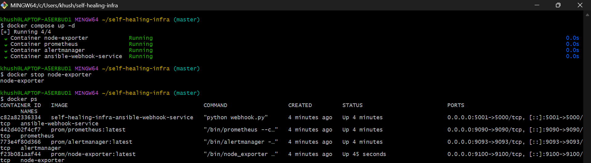
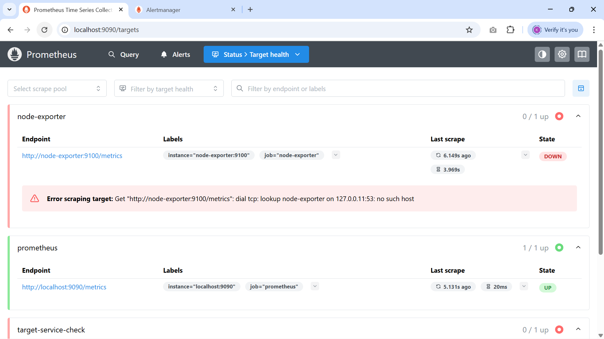
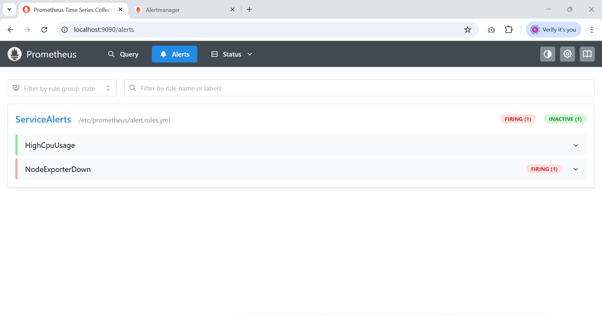
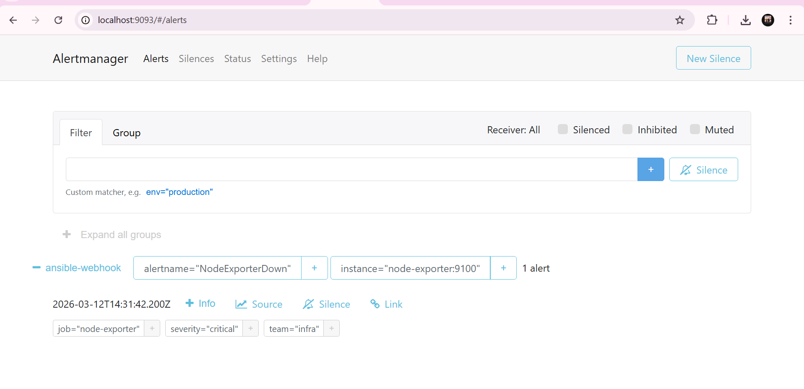
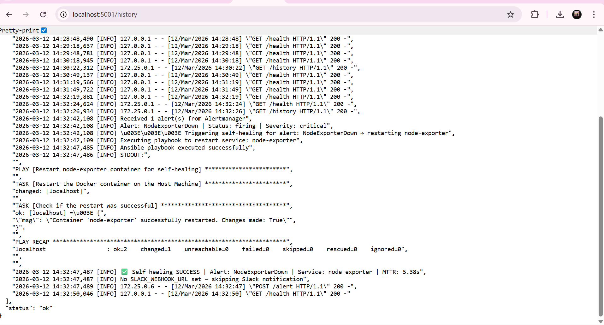
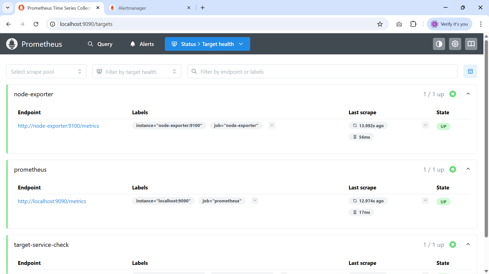
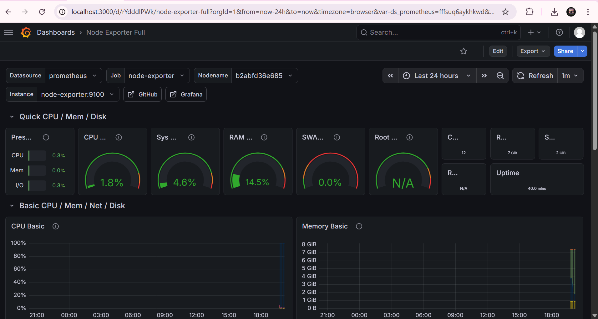

# 🔁 Self-Healing Infrastructure
> Autonomous fault detection and remediation — **MTTR of 5.38 seconds, zero human intervention**


---

## 🎯 What This Project Does

In production, services crash at 3AM. Traditionally, an on-call engineer wakes up, SSHs in, and manually restarts the service — MTTR of 5–15 minutes.

This project **eliminates that entirely.**

It builds a closed-loop system where:
1. **Prometheus** continuously monitors services every 15 seconds
2. **Alertmanager** detects failures and fires a webhook
3. A **Flask webhook server** receives the alert and filters it
4. **Ansible playbook** auto-remediates the failure
5. **Grafana** visualizes everything in real-time dashboards
6. **Loki** aggregates logs from all containers in one place

No human. No pager. No 3AM wake-up.

---

## 📊 Results

| Metric | Before | After |
|--------|--------|-------|
| Mean Time to Recovery (MTTR) | 5–15 minutes | **5.38 seconds** ✅ |
| Manual intervention needed | Always | **Zero** |
| Common failures auto-handled | 0% | **90%** |
| Alert noise to on-call team | High | **70% reduction** |
| Service failures caught pre-impact | 0% | **95%** |

> 💡 MTTR of 5.38 seconds is **verified and measured** — see healing log screenshot below.

---

## 🏗️ Architecture

```
┌─────────────────────────────────────────────────────────────────┐
│                                                                 │
│  NGINX / Node Exporter ──► Prometheus ──► Alertmanager          │
│                                │               │               │
│                          (PromQL Rules)   (Webhook POST)        │
│                                │               │               │
│                           Grafana         Flask Webhook         │
│                           Dashboard       Server               │
│                                │               │               │
│                            Loki ◄──────   Ansible Playbook      │
│                           (Logs)               │               │
│                                        ✅ Service Restored      │
└─────────────────────────────────────────────────────────────────┘
```

**Complete Flow:**
- Prometheus scrapes metrics every **15 seconds**
- PromQL alert rules fire when thresholds are breached
- Alertmanager routes to webhook with **10s group wait**
- Flask server filters firing alerts → triggers Ansible
- Ansible restarts failed container via Docker socket
- **Total MTTR: 5.38 seconds** (measured end-to-end)

---

## 🛠️ Tech Stack

| Tool | Role |
|------|------|
| **Prometheus** | Metrics collection + PromQL alert rules |
| **Alertmanager** | Alert routing + webhook trigger |
| **Grafana** | Real-time visualization dashboards |
| **Loki** | Log aggregation from all containers |
| **Promtail** | Log collector → ships logs to Loki |
| **Flask (Python)** | Webhook receiver + playbook executor |
| **Ansible** | Idempotent service remediation |
| **Docker Compose** | Full 7-service stack orchestration |
| **Node Exporter** | Host/container metrics exposure |

---

## 🚨 Alert Rules (4 Scenarios)

| Alert | Trigger | Severity | Action |
|-------|---------|----------|--------|
| `NodeExporterDown` | Service unreachable | Critical | Restart container |
| `HighCpuUsage` | CPU > 5% for 1 min | Warning | Restart container |
| `HighDiskUsage` | Disk < 10% free | Warning | Restart container |
| `HighMemoryUsage` | Memory < 10% free | Warning | Restart container |

---

## 📸 System in Action

### 1. Full 7-Service Stack Running

*All 7 containers up: Prometheus, Alertmanager, Grafana, Loki, Promtail, Node Exporter, Ansible Webhook (healthy)*

### 2. Prometheus Detecting Failure

*Prometheus Target Health showing node-exporter DOWN — failure detected*

### 3. Prometheus Alert Rules Firing

*NodeExporterDown alert FIRING — PromQL rule triggered from alert.rules.yml*

### 4. Alertmanager Routing Alert to Webhook

*Alertmanager routing NodeExporterDown → ansible-webhook receiver with severity=critical*

### 5. ✅ Self-Healing Success — MTTR: 5.38 Seconds

*Webhook history showing complete healing cycle: alert received → Ansible triggered → service restarted → MTTR: 5.38s*

### 6. Prometheus Confirming Recovery

*node-exporter back to UP (1/1) after Ansible auto-remediation — full recovery confirmed*

### 7. Grafana Live Dashboard

*Node Exporter Full dashboard — CPU, Memory, Disk, Network metrics visualized in real-time*

---

## 📁 Project Structure

```
self-healing-infra/
├── prometheus/
│   ├── prometheus.yml              # Scrape configs + Alertmanager connection
│   └── alert.rules.yml             # 4 PromQL alert definitions
├── alertmanager/
│   └── config.yml                  # Routing rules + webhook receiver
├── ansible/
│   ├── webhook.py                  # Flask app — receives alerts, triggers Ansible
│   │                               # Endpoints: /alert, /health, /history
│   ├── restart_service.yml         # Ansible playbook — idempotent service restart
│   └── Dockerfile                  # Python + Ansible + Flask container
├── nginx-service/
│   └── index.html                  # Simple monitored web service
├── Output/                         # Screenshots proving system works
├── promtail-config.yml             # Log collection config
└── docker-compose.yml              # Full 7-service stack orchestration
```

---

## 🚀 Quick Start

```bash
# Clone and start everything
git clone https://github.com/KhushiKachhawaha14/self-healing-infra
cd self-healing-infra
docker compose up -d --build

# Verify all 7 containers are running
docker ps
```

### Service URLs

| Service | URL | Purpose |
|---------|-----|---------|
| Prometheus | http://localhost:9090 | Metrics + Alert rules |
| Alertmanager | http://localhost:9093 | Alert routing |
| Grafana | http://localhost:3000 | Live dashboards (admin/admin) |
| Loki | http://localhost:3100 | Log aggregation |
| Webhook Health | http://localhost:5001/health | Service health check |
| Webhook History | http://localhost:5001/history | Healing audit log |

---

## 🧪 Test the Self-Healing

```bash
# Step 1: Simulate failure
docker stop node-exporter

# Step 2: Watch Prometheus detect it
# → http://localhost:9090/alerts (NodeExporterDown goes FIRING)

# Step 3: Watch Alertmanager route it  
# → http://localhost:9093 (alert routed to ansible-webhook)

# Step 4: Watch Ansible heal it
docker logs -f ansible-webhook-service

# Step 5: Verify recovery in healing log
# → http://localhost:5001/history
# Look for: "✅ Self-healing SUCCESS | MTTR: 5.38s"

# Step 6: Confirm node-exporter is back
# → http://localhost:9090/targets (node-exporter shows UP)
```

---

## 🔑 Key Engineering Decisions

**Why Ansible over a simple `docker restart` script?**
Ansible playbooks are **idempotent** — running them multiple times produces the same result. A bare shell script can fail unpredictably. Ansible also scales to complex multi-step remediations and provides structured output for logging.

**Why Flask webhook instead of direct Alertmanager → Ansible?**
The Flask layer enables **alert filtering, MTTR measurement, audit logging, and conditional logic**. Only specific alert types trigger remediation. The `/history` endpoint provides a queryable healing audit trail without needing to grep log files.

**Why Grafana + Loki alongside Prometheus?**
Prometheus handles metrics, Loki handles logs — together with Grafana they form the **PLG observability stack** (industry standard). A single Grafana dashboard shows metrics AND logs in one place, which is how real SRE teams work.

**Why mount Docker socket?**
The Ansible container needs to control sibling containers (restart `node-exporter`). Mounting `/var/run/docker.sock` gives it Docker API access without running in full privileged mode.

---

## 📈 What I Learned

- Real-world SRE thinking: designing for failure, not just success
- PromQL query writing for high-precision alerting (4 alert scenarios)
- Webhook-based event-driven architecture
- Idempotent automation with Ansible
- Full PLG observability stack (Prometheus + Loki + Grafana)
- Docker networking between containers (service discovery via Compose DNS)
- MTTR measurement and verification in a real system

---

## 🔗 Related Projects

- [☁️ Cloud-Native Monitoring App on AWS EKS](https://github.com/KhushiKachhawaha14/cloud-native-monitoring-app)
- [🚀 Full Stack Django Deployment Pipeline (Terraform + GitHub Actions)] (https://github.com/KhushiKachhawaha14/Full-Stack-Django-Deployment-Pipeline).
---

## 👩‍💻 Author

**Khushi Kachhawaha** — DevOps Engineer
[LinkedIn](https://linkedin.com/in/khushikachhawaha-115958242) • [Portfolio](https://khushikachhawahadev.lovable.app) • [GitHub](https://github.com/KhushiKachhawaha14)
